# UWP ハンズオン資料

これは UWP で簡単なお絵かきアプリを作ってみるハンズオンです。

以下の環境を前提としています。

- Windows 10 Fall Creators Update
- Visual Studio 2017 15.6
    - インストール時に「ユニバーサル Windows プラットフォーム開発」にチェックを入れていること

## プロジェクトの作成

1. ファイル → 新規作成 → プロジェクトを選択
2. Visual C# → Windows ユニバーサル を選択
3. 「空白のアプリ（ユニバーサル Windows）を選択
4. 名前に「DrawingApp」と入力して OK を選択

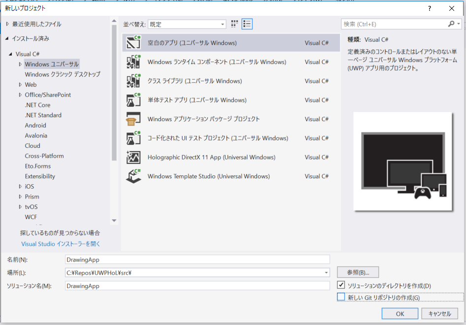

5. ターゲット バージョンに「Windows 10 Fall Creators Update(10.0: ビルド 16299)」を選択
6. 最小バージョンに「Windows 10 Anniversary Update(10.0: ビルド 14393」を選択
7. OK を選択

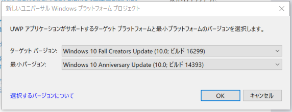

## 画像を表示する

ボタンと画像を置いて画像を開く機能を追加します。

1. `MainPage.xaml` を開いて以下のように編集します。

```xml
<Page x:Class="DrawingApp.MainPage"
      xmlns="http://schemas.microsoft.com/winfx/2006/xaml/presentation"
      xmlns:x="http://schemas.microsoft.com/winfx/2006/xaml"
      xmlns:local="using:DrawingApp"
      xmlns:d="http://schemas.microsoft.com/expression/blend/2008"
      xmlns:mc="http://schemas.openxmlformats.org/markup-compatibility/2006"
      mc:Ignorable="d">
    <Page.BottomAppBar>
        <CommandBar>
            <AppBarButton Icon="OpenFile"
                          Label="Open"
                          Click="OpenFileButton_Click" />
        </CommandBar>
    </Page.BottomAppBar>
    <Grid Background="{ThemeResource ApplicationPageBackgroundThemeBrush}">
        <ScrollViewer>
            <Image x:Name="picture"
                   Stretch="None"
                   HorizontalAlignment="Left"
                   VerticalAlignment="Top" />
        </ScrollViewer>
    </Grid>
</Page>
```

2. `MainPage.xaml.cs` に画像を開く処理を追加

```cs
using System;
using Windows.Storage;
using Windows.Storage.Pickers;
using Windows.UI.Xaml;
using Windows.UI.Xaml.Controls;
using Windows.UI.Xaml.Media.Imaging;

namespace DrawingApp
{
    public sealed partial class MainPage : Page
    {
        public MainPage()
        {
            this.InitializeComponent();
        }

        private async void OpenFileButton_Click(object sender, RoutedEventArgs e)
        {
            var picker = new FileOpenPicker();
            picker.FileTypeFilter.Add(".png");
            picker.FileTypeFilter.Add(".jpg");
            picker.FileTypeFilter.Add(".jpeg");

            picker.SuggestedStartLocation = PickerLocationId.PicturesLibrary;

            var file = await picker.PickSingleFileAsync();
            if (file == null)
            {
                return;
            }

            using (var stream = await file.OpenAsync(FileAccessMode.Read))
            {
                var image = new BitmapImage();
                await image.SetSourceAsync(stream);
                picture.Source = image;
            }
        }
    }
}
```

3. Visual Studio でターゲットプラットフォームが x86 になっているのを確認して ローカルコンピューター を選択

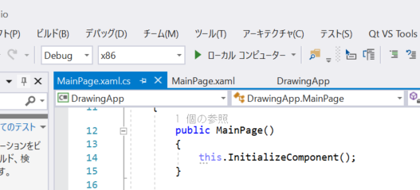

4. アプリが起動します。画面下部の Open ボタンを選択すると画像を開いて表示されます。

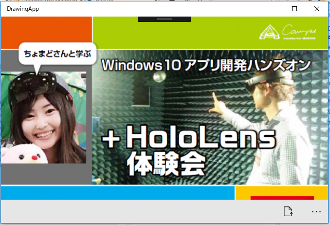

## お絵かき機能を付ける

UWP のインク機能を使用してお絵かき機能を追加します。

1. `MainPage.xaml` を開いて InkCanvas, InkToolbar を追加します。画像サイズが変わったときのイベントハンドラも追加します。

```xml
<Page x:Class="DrawingApp.MainPage"
      xmlns="http://schemas.microsoft.com/winfx/2006/xaml/presentation"
      xmlns:x="http://schemas.microsoft.com/winfx/2006/xaml"
      xmlns:local="using:DrawingApp"
      xmlns:d="http://schemas.microsoft.com/expression/blend/2008"
      xmlns:mc="http://schemas.openxmlformats.org/markup-compatibility/2006"
      mc:Ignorable="d">
    <Page.BottomAppBar>
        <CommandBar>
            <AppBarButton Icon="OpenFile"
                          Label="Open"
                          Click="OpenFileButton_Click" />
        </CommandBar>
    </Page.BottomAppBar>
    <Grid Background="{ThemeResource ApplicationPageBackgroundThemeBrush}">

        <ScrollViewer>
            <Grid>
                <Image x:Name="picture"
                       Stretch="None"
                       HorizontalAlignment="Left"
                       VerticalAlignment="Top" 
                       SizeChanged="Picture_SizeChanged"/>
                <InkCanvas x:Name="inkCanvas"
                           HorizontalAlignment="Left"
                           VerticalAlignment="Top" />
            </Grid>
        </ScrollViewer>
        <InkToolbar TargetInkCanvas="{x:Bind inkCanvas}" 
                    VerticalAlignment="Top" />
    </Grid>
</Page>
```

2. `MainPage.xaml.cs` に以下のイベントハンドラを追加します。

```cs
private void Picture_SizeChanged(object sender, SizeChangedEventArgs e)
{
    // キャンバスサイズを画像と合わせる
    inkCanvas.Width = picture.ActualWidth;
    inkCanvas.Height = picture.ActualHeight;
}
```

3. デフォルトの挙動がペンのみへの対応なのでタッチ・マウスにも対応させるコードを追加
4. `MainPage.xaml.cs` のコンストラクタを以下のように変更

```cs
// 画面上部に以下の using を追加
// using Windows.UI.Core;

public MainPage()
{
    this.InitializeComponent();

    inkCanvas.InkPresenter.InputDeviceTypes = CoreInputDeviceTypes.Pen |
        CoreInputDeviceTypes.Mouse |
        CoreInputDeviceTypes.Touch;
}
```

5. 実行して動作確認をします。画像を開いて、その上に絵が描けます。ペンの種類や太さも変えることが出来ます。

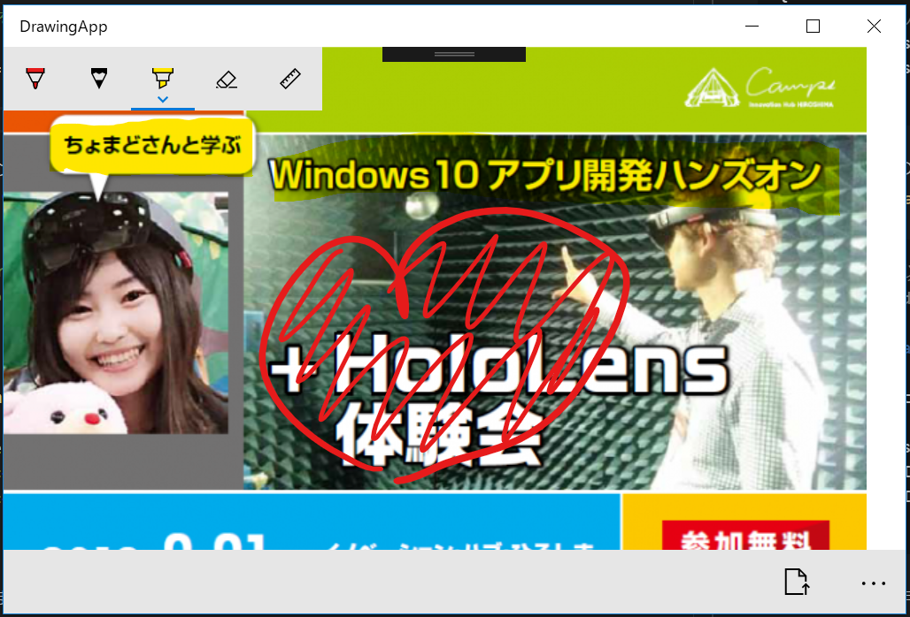

## ファイル保存機能の追加

UWP 組み込みでは画像と InkCanvas の線を合成して画像に保存する機能がないので Win2D.UWP というライブラリを使用します。

1. プロジェクトの参照の右クリックメニューから「NuGet パッケージの管理」を選択

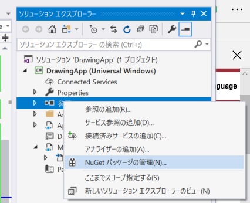

2. 参照タブを選択して Win2D.UWP で検索をして表示される「Win2D.uwp 作成者 Microsoft」を選択して「インストール」を選択

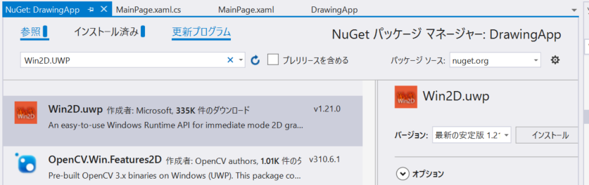

3. `MainPage.xaml.cs` に画像を開いたタイミングで後で保存するための画像を保持するコードを追加

```cs
using Microsoft.Graphics.Canvas; // 追加
using System;
using Windows.Storage;
using Windows.Storage.Pickers;
using Windows.UI.Core;
using Windows.UI.Xaml;
using Windows.UI.Xaml.Controls;
using Windows.UI.Xaml.Media.Imaging;

namespace DrawingApp
{
    public sealed partial class MainPage : Page
    {
        private CanvasBitmap _image; // 追加
        public MainPage()
        {
            // 省略
        }

        private async void OpenFileButton_Click(object sender, RoutedEventArgs e)
        {
            var picker = new FileOpenPicker();
            picker.FileTypeFilter.Add(".png");
            picker.FileTypeFilter.Add(".jpg");
            picker.FileTypeFilter.Add(".jpeg");

            picker.SuggestedStartLocation = PickerLocationId.PicturesLibrary;

            var file = await picker.PickSingleFileAsync();
            if (file == null)
            {
                return;
            }

            using (var stream = await file.OpenAsync(FileAccessMode.Read))
            {
                var image = new BitmapImage();
                await image.SetSourceAsync(stream);
                picture.Source = image;

                // 後で保存するための画像を保持
                var device = CanvasDevice.GetSharedDevice();
                _image = await CanvasBitmap.LoadAsync(device, stream);
            }
        }
        // 省略
    }
}
```

4. `MainPage.xaml` を開いて画像を保存するためのボタンを追加

```xml
<Page x:Class="DrawingApp.MainPage"
      xmlns="http://schemas.microsoft.com/winfx/2006/xaml/presentation"
      xmlns:x="http://schemas.microsoft.com/winfx/2006/xaml"
      xmlns:local="using:DrawingApp"
      xmlns:d="http://schemas.microsoft.com/expression/blend/2008"
      xmlns:mc="http://schemas.openxmlformats.org/markup-compatibility/2006"
      mc:Ignorable="d">
    <Page.BottomAppBar>
        <CommandBar>
            <AppBarButton Icon="OpenFile"
                          Label="Open"
                          Click="OpenFileButton_Click" />
            <!-- 追加 -->
            <AppBarButton Icon="Save"
                          Label="Save"
                          Click="SaveFileButton_Click" />
        </CommandBar>
    </Page.BottomAppBar>
    <Grid Background="{ThemeResource ApplicationPageBackgroundThemeBrush}">
        <!-- 省略 -->
    </Grid>
</Page>
```

5. `MainPage.xaml.cs` を開いて SaveFileButton_Click メソッドを追加します

```cs
using Microsoft.Graphics.Canvas;
using System;
using System.Collections.Generic; // 追加
using Windows.Storage;
using Windows.Storage.Pickers;
using Windows.UI; // 追加
using Windows.UI.Core;
using Windows.UI.Xaml;
using Windows.UI.Xaml.Controls;
using Windows.UI.Xaml.Media.Imaging;

namespace DrawingApp
{
    public sealed partial class MainPage : Page
    {
        // 省略

        // 追加
        private async void SaveFileButton_Click(object sender, RoutedEventArgs e)
        {
            var picker = new FileSavePicker();
            picker.SuggestedStartLocation = PickerLocationId.PicturesLibrary;
            picker.FileTypeChoices.Add("png", new List<string> { ".png" });
            var file = await picker.PickSaveFileAsync();
            if (file == null)
            {
                return;
            }

            var device = CanvasDevice.GetSharedDevice();
            var renderTarget = new CanvasRenderTarget(device, (int)_image.Size.Width, (int)_image.Size.Height, 96);
            using (var ds = renderTarget.CreateDrawingSession())
            {
                ds.Clear(Colors.White);
                ds.DrawImage(_image, 0, 0);
                ds.DrawInk(inkCanvas.InkPresenter.StrokeContainer.GetStrokes());
            }

            using (var stream = await file.OpenAsync(Windows.Storage.FileAccessMode.ReadWrite))
            {
                await renderTarget.SaveAsync(stream, CanvasBitmapFileFormat.Png);
            }
        }
    }
}
```

6. 実行して動作確認。描いた絵が保存できるようになっています。

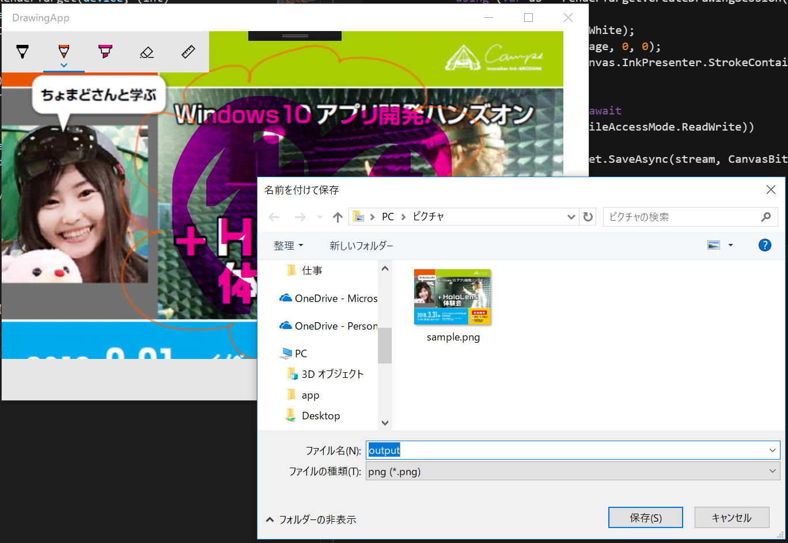

# 参考情報：ストアへ公開するには

## アイコンを準備しよう

デフォルトアイコンではストアに公開できないのでオリジナルのアイコンを準備します。

Visual Studio で Package.appxmanifest を開いて「ビジュアル資産」タブにある「資産ジェネレーター」のソースにアイコンにしたい画像を選択すると必要なサイズの画像が自動的に作成されます。

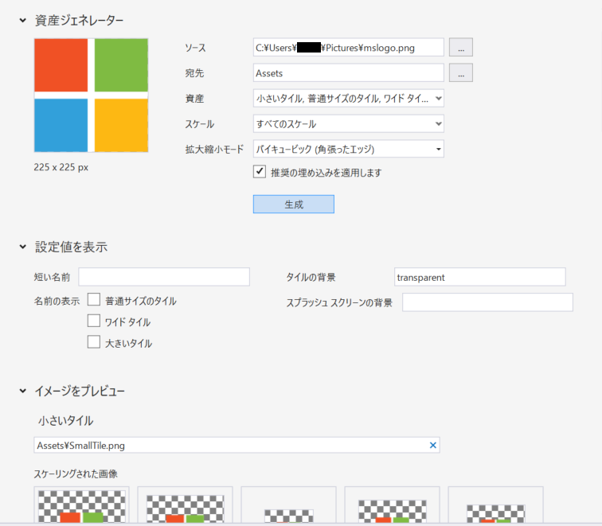

## 開発者アカウントをつくろう

Microsoft ストアにアプリを提出するにはアプリ開発者としての登録が必要です。

[アプリ開発者として登録する](https://developer.microsoft.com/ja-jp/store/register)

個人アカウントが約19ドル（約2,000円）、企業アカウントが約99ドル（約10,000円）です。登録料金で更新料はかかりません。

## ストアに提出するパッケージを作ろう

プロジェクトを右クリックして「ストア」→「アプリパッケージの作成」を選択します。

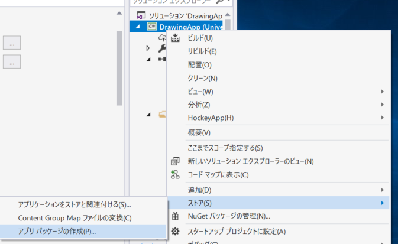

ストアにアップロードするパッケージで「はい」を選択します。

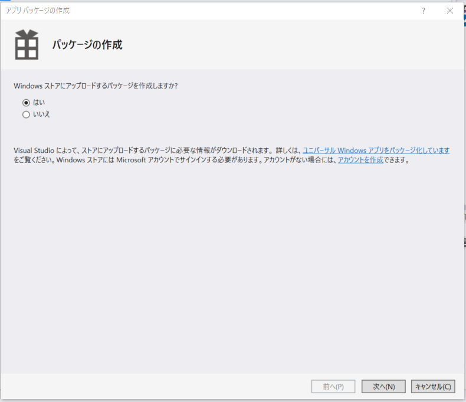

ストアのダッシュボード（開発者登録するとサインインできます）で作成したアプリ名と紐づけます。まだ作成してない場合は、ここでアプリ名を予約することもできます。

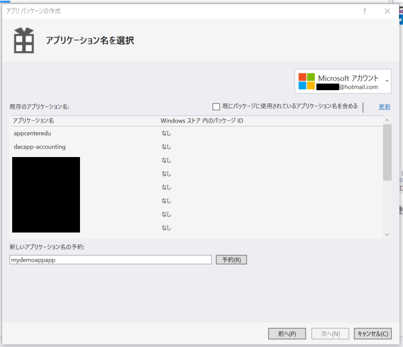

Release モードになっているのを確認して「作成」を選択します。選択するとストアにアップロードするためのパッケージの作成がはじまります。
これには数分の時間がかかります。

パッケージの作成が終わると「Windows アプリ認定キット」によるチェックを促されます。
このチェックはストアに提出したときにも機械的に実行され、ここでエラーが出るとストアに公開されないため手元で実行しておくことをお勧めします。

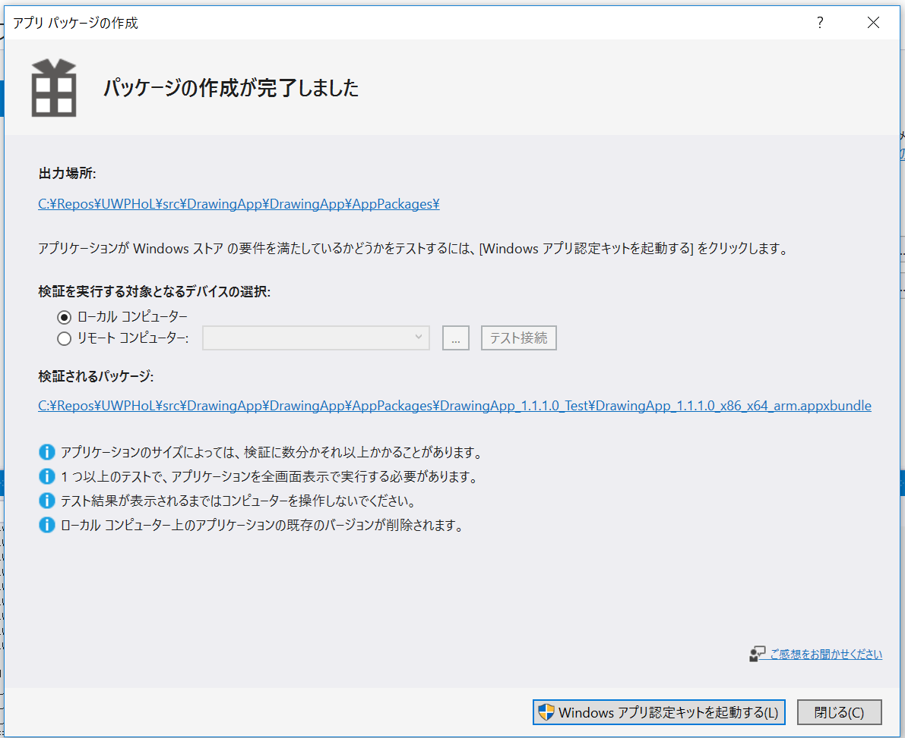

認定キットでのチェックでエラーが出た場合は修正をしましょう。エラーがなくなったら開発者登録すると入れるようになるダッシュボードから appxupload の拡張子のファイルを提出します。

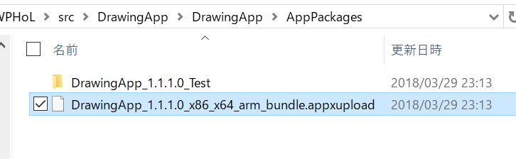

審査に通過するとマイクロソフトストアにアプリが公開されます。